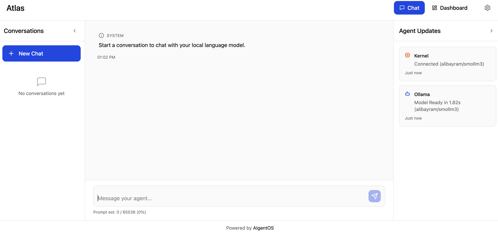

# AIgentOS

<p align="center">
  
</p>

Kernel-first OSS for self-hosted AI agents.  
The kernel is the product; the WebUI is an optional add-on.

## Why This Project

There are already large open-source projects (for example, [Open WebUI](https://docs.openwebui.com/)).
AIgentOS is intentionally a lightweight baseline for running a local multi-turn chatbot in Docker, with a focus on simplicity and transparency.

This project is built to provide:
- A small, understandable codebase with clear backend behavior
- Practical visibility into prompt/runtime logic and performance data
- A kernel foundation for future agent systems, including alternatives to tool-calling workflows in later versions

This baseline comes from building multiple agents and needing an abstracted kernel to reuse across future agent experiences.

## Who This Is For

- People who want a highly personalized and consistent chatbot experience, and prefer stable, bounded behavior over constantly changing frontier features
- People who care about security/privacy and want practical local capabilities (summarization, rubber-ducking, open-model experimentation) without heavy infrastructure

## Project Scope (Current OSS Baseline)

This repository currently ships:
- A FastAPI-based kernel (`/kernel`) with Ollama chat integration
- Prompt component/profile management (`/agent-prompts`)
- Local SQLite conversation storage in `/models-local/chat.db`
- Performance/debug API surfaces for recent exchanges
- A Vite/React WebUI (`/agent-webui`) as an optional interface

## Why One Repo (for now)

We keep kernel and WebUI in one repo right now for simpler OSS onboarding, versioning, and CI.

- The kernel remains independently useful without the WebUI.
- The WebUI is treated as a reference client and bonus add-on.
- If ecosystem usage grows, splitting into `-kernel` and `-webui` repos later is straightforward.

## Why SmolLM3

Default prompt configs are centered around SmolLM3-class usage because the model family is:
- Open, with strong visibility into training methodology/data disclosures
- Practical for local/self-hosted inference footprints
- Intended to be commercially usable (Apache-2.0)

Always validate model and dataset terms for your own deployment and jurisdiction.
- https://huggingface.co/HuggingFaceTB/SmolLM3-3B
- https://ollama.com/alibayram/smollm3


## Repository Layout

```text
.
├── kernel/          # Kernel API and orchestration logic
├── agent-prompts/   # Prompt bundle + components (default agent profile)
├── agent-webui/     # Optional WebUI client
├── models-local/    # Local runtime data (e.g., SQLite chat DB)
├── docker-compose.yml
└── LICENSE
```

## Quick Start

### Prerequisites
- [Docker + Docker Compose](https://www.docker.com/) 
- [Ollama](https://ollama.com/) running on the host

### Run full stack (kernel + optional WebUI)

```bash
docker compose up -d
```

Default endpoints:
- WebUI: `http://localhost:5500`
- Kernel API: `http://localhost:5501`

### Run kernel only

```bash
docker compose up -d kernel
```

## API Snapshot

Current kernel endpoints include:
- `GET /health`
- `POST /api/chat`
- `POST /api/llm/warmup`
- Conversation CRUD under `/api/conversations`
- Prompt settings/profiles/components under `/api/prompts/*`
- Performance/debug surfaces under `/api/performance/*` and `/api/debug/logs`
- Admin export/reset endpoints under `/api/admin/*`

## Baseline Perf Data

Baseline runs are tracked in `/baseline/perf/` (timestamped markdown reports).

Current dataset snapshot:
- 3 runs on `alibayram/smollm3`
- 34 calls per run across: simple Q/A, summarization, 20-turn chat, structured extraction, and system-prompt pressure
- Total run duration observed: `141.62s` to `235.97s`

Observed ranges from those runs:
- 20-turn conversation average latency: `2.65s` to `6.25s` per turn
- 20-turn conversation max single-turn latency: up to `16.23s`
- System prompt pressure at ~10k system tokens: `14.40s` to `22.80s`
- 2000-token summarization latency: `3.93s` to `10.51s`

Baseline reports:

Benchmark environment:
- Apple M3 Pro
- 18 GB RAM
- macOS Tahoe 26.3

| Report | Completed (local) | Calls | Simple Q/A min-max | Summarization min-max | 20-turn min-max | Structured extraction min-max | System prompt pressure min-max |
|---|---|---:|---:|---:|---:|---:|---:|
| [baseline-20260219-022655.md](baseline/perf/baseline-20260219-022655.md) | 2026-02-19 02:26:33 | 34 | 1.91s-9.52s | 3.55s-5.55s | 2.81s-5.04s | 2.61s-2.61s | 2.37s-14.40s |
| [baseline-20260219-025528.md](baseline/perf/baseline-20260219-025528.md) | 2026-02-19 02:30:54 | 34 | 6.98s-24.82s | 3.16s-10.51s | 2.10s-16.23s | 3.69s-3.69s | 2.41s-15.09s |
| [baseline-20260219-030717.md](baseline/perf/baseline-20260219-030717.md) | 2026-02-19 03:07:04 | 34 | 7.58s-8.97s | 3.41s-7.04s | 2.29s-3.15s | 5.04s-5.04s | 2.03s-22.80s |

Interpretation:
- Latency is most sensitive to effective prompt size and completion length.
- The 20-turn test shows context growth impact over time.

## License

AIgentOS uses a split-license model:
- `kernel/` -> MPL-2.0
- `agent-webui/` -> Apache-2.0
- `agent-prompts/` -> Apache-2.0

See `/LICENSE` for the directory-level map and rationale, and the license files inside each directory for full legal text.
