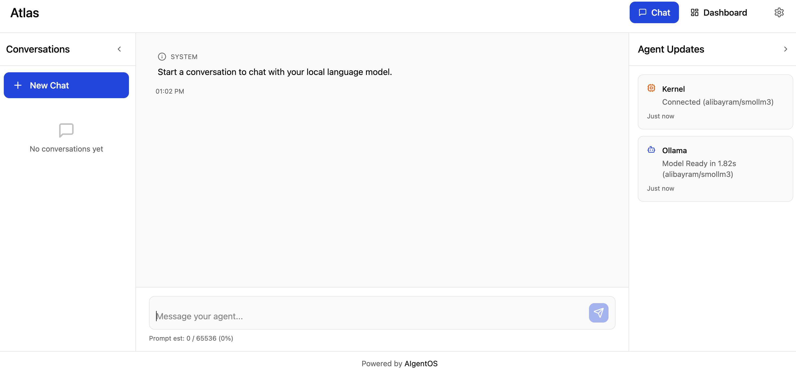
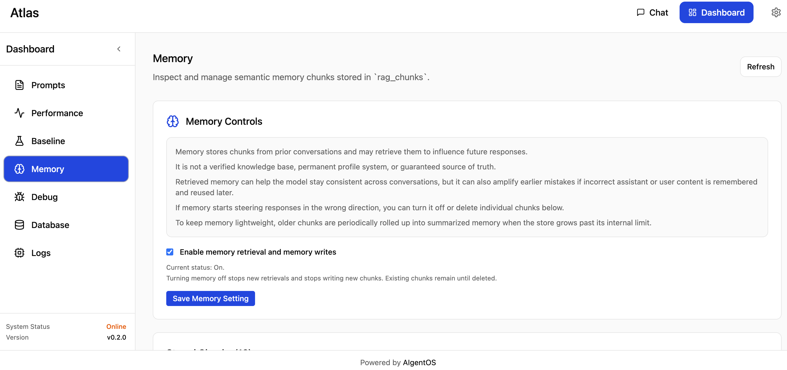
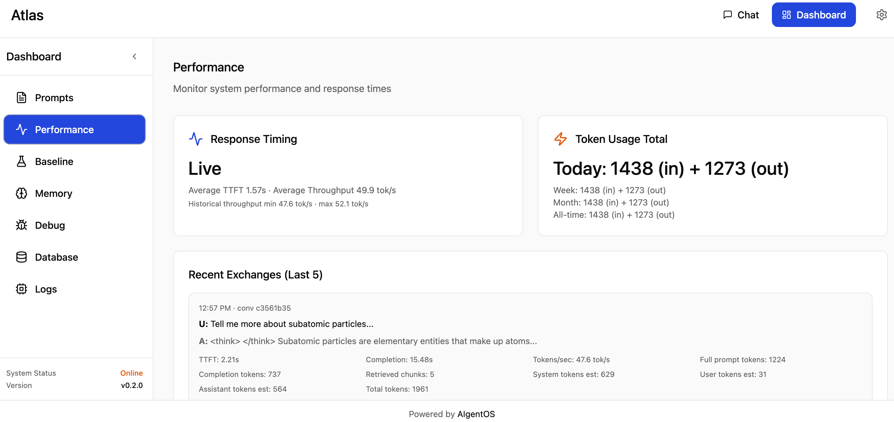
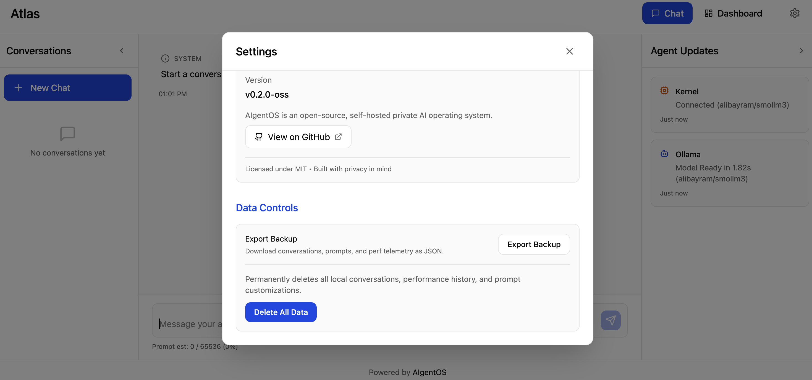

# AIgentOS



Kernel-first OSS for self-hosted AI agents.  
The kernel is the product; the WebUI is an optional add-on.

## Why This Project

There are already large open-source projects (for example, [Open WebUI](https://docs.openwebui.com/)).
AIgentOS is intentionally a lightweight baseline for running a local multi-turn chatbot in Docker, with a focus on simplicity and transparency.

This project is built to provide:
- A small, understandable codebase with clear backend behavior
- Practical visibility into prompt/runtime logic and performance data
- A kernel foundation for future agent systems, including alternatives to tool-calling workflows in later versions

This baseline comes from building multiple agents and needing an abstracted kernel to reuse across future agent experiences.

## Who This Is For

- People who want a highly personalized and consistent chatbot experience, and prefer stable, bounded behavior over constantly changing frontier features
- People who care about security/privacy and want practical local capabilities (summarization, rubber-ducking, open-model experimentation) without heavy infrastructure

## Project Scope (Current OSS Baseline)

This repository currently ships:
- A FastAPI-based kernel (`/kernel`) with Ollama chat integration
- Async dialogue worker that processes messages in the background with real-time streaming via SSE
- Lightweight conversation memory backed by SQLite chunk storage and semantic retrieval (embedding-based)
- Packaged MCP support, including a bundled `MarkItDown MCP` example for document import
- Prompt component/profile management (`/agent-prompts`)
- Local SQLite conversation and event storage in `/models-local/chat.db`
- Performance/debug API surfaces with TTFT tracking, token breakdowns, and baseline benchmarking
- A Vite/React WebUI (`/agent-webui`) as an optional interface

Current release line: `v0.3.0-oss`

## Why One Repo (for now)

We keep kernel and WebUI in one repo right now for simpler OSS onboarding, versioning, and CI.

- The kernel remains independently useful without the WebUI.
- The WebUI is treated as a reference client and bonus add-on.
- If ecosystem usage grows, splitting into `-kernel` and `-webui` repos later is straightforward.

## Why SmolLM3

Default prompt configs are centered around SmolLM3-class usage because the model family is:
- Open, with strong visibility into training methodology/data disclosures
- Practical for local/self-hosted inference footprints
- Intended to be commercially usable (Apache-2.0)

Always validate model and dataset terms for your own deployment and jurisdiction.
- https://huggingface.co/HuggingFaceTB/SmolLM3-3B
- https://ollama.com/alibayram/smollm3


## Repository Layout

```text
.
├── kernel/              # Kernel API and orchestration logic
│   ├── api/             # FastAPI endpoints, storage, LLM client, models
│   ├── workers/         # Background workers (dialogue, orchestrator)
│   └── shared/          # Shared utilities (text processing, token metrics)
├── agent-prompts/       # Prompt bundle + components (default agent profile)
├── agent-webui/         # Optional WebUI client
├── models-local/        # Local runtime data (e.g., SQLite chat DB, uploads)
├── docker-compose.yml
└── LICENSE
```

## Quick Start

### Prerequisites
- [Docker + Docker Compose](https://www.docker.com/) 
- [Ollama](https://ollama.com/) running on the host

### Run full stack (kernel + optional WebUI)

```bash
docker compose up -d
```

This starts the kernel, dialogue worker, orchestrator worker, WebUI, and the bundled `markitdown-mcp` service used for document import.

Default endpoints:
- WebUI: `http://localhost:5500`
- Kernel API: `http://localhost:5501`

### Run kernel only

```bash
docker compose up -d kernel
```

## API Snapshot

Current kernel endpoints include:
- `GET /health`
- `GET /api/worker/health` — dialogue and orchestrator worker heartbeat status
- `POST /api/chat`
- `POST /api/llm/warmup`
- `GET /api/conversations/{id}/stream` — SSE stream for real-time event updates
- Conversation CRUD under `/api/conversations`
- Memory management under `/api/memory/chunks`
- Document import under `/api/imports`
- MCP server management under `/api/mcp/servers`
- Prompt settings/profiles/components under `/api/prompts/*`
- Performance/debug surfaces under `/api/performance/*` and `/api/debug/logs`
- Baseline benchmarking under `/api/baseline/*`
- Admin export/reset endpoints under `/api/admin/*`

## Memory and Thinking Notes


- `Memory` in the current OSS baseline means conversation memory, not a general-purpose knowledge base or structured profile/entity system.
- Memory stores chunks derived from prior user/assistant turns and may retrieve them to influence future responses.
- Retrieved memory can improve continuity, but it can also reinforce earlier mistakes if incorrect content gets remembered and reused later.
- To keep the system lightweight, older memory chunks are periodically rolled up into summarized memory when the store grows past its configured limit.
- Thinking-capable models may emit visible `<think>...</think>` content. AIgentOS currently keeps that behavior as-is and does not expose a separate runtime toggle to disable thinking output.

## Architecture Notes

- **Shared utilities** live in `kernel/shared/` (text processing, token estimation). Both the kernel API and the workers import from here to avoid duplication.
- **Two background workers run independently**:
  - The **dialogue worker** owns direct-dialogue turns and RAG retrieval. It only runs after the orchestrator has explicitly routed a turn to `direct_dialogue`.
  - The **orchestrator worker** makes an LLM routing call to decide whether a turn should go to dialogue or to a tool/subagent path (routing prompt: `agent-prompts/orchestrator/routing.md`). Tool-routed turns are completed by the orchestrator; post-turn, it selects durable memory candidates and runs compaction. Document import is also handled here through MCP.
- **Routing vs planning are intentionally separate**:
  - the orchestrator is currently a routing layer, not a full planner
  - it decides whether to use dialogue, a native tool/subagent, or an MCP tool
  - once a route is selected, the chosen tool path is responsible for planning its own work
  - example: `math_subagent` is responsible for turning a word problem into a deterministic expression; the orchestrator only decides whether math should be invoked
- **Known OSS limitation**: tool execution is deterministic once invoked, but tool-specific planning quality still depends on the small local model backing the selected subagent/tool prompt. In practice, this means tool calling can be structurally correct while still producing a weak plan or wrong expression.
- **Observed performance tradeoff**:
  - `v0.2.0` async RAG stays relatively close to the base model because memory retrieval is lightweight and the chat path remains simple
  - `v0.3.0` async orchestration adds real control-plane cost because a turn may now require routing, subagent planning, and tool execution before the assistant can respond
  - even with streaming, richer tool use makes the system feel meaningfully slower than plain async chat
  - on local hardware, that extra orchestration cost is not just a latency issue; it also increases sustained load, heat, fan activity, and battery/energy usage
  - this tradeoff is one of the clearest reasons the broader OSCAR architecture exists: once tool use becomes central, naive orchestration is too expensive unless the system separates fast-path interaction from heavier background capability work much more deliberately
- **Why v0.4.0 exists**:
  - `v0.2.0` proves that async RAG can preserve a chat-like feel
  - `v0.3.0` proves that richer capability layers are valuable but expensive
  - the `v0.4.0` direction is therefore not simply "more features"; it is "why not both?" — keep the responsiveness of `v0.2.0`, keep the capability ambitions of `v0.3.0`, and move more work into a less blocking async architecture so the fast path stays fast
- **Tool boundary** is intentionally split:
  - native tools remain in-kernel when they are core, deterministic, and lightweight enough to justify hard guarantees
  - MCP tools are used for replaceable external capabilities
  - in the current OSS baseline, **math stays native** and **document import is powered by MarkItDown MCP**
- **Packaged MCP example**: document conversion runs through a dedicated `markitdown-mcp` service. AIgentOS stores the uploaded file locally, calls MarkItDown over MCP, then chunks and embeds the returned Markdown.
- **Attribution**: the bundled document-conversion example is powered by [Microsoft MarkItDown](https://github.com/microsoft/markitdown).
- **Token estimation** currently uses a `char_count / 4` heuristic. This is a known approximation; future versions may use Ollama's `/api/tokenize` endpoint for accuracy.
- **RAG retrieval** computes cosine similarity against all stored memory chunks. This is acceptable at the default chunk limit (160) but will not scale to thousands of chunks without indexing.
- **SSE streaming** (`/api/conversations/{id}/stream`) includes an idle timeout (~5 minutes) and handles client disconnection gracefully.
- **Worker health** is tracked via per-worker heartbeats written to the database each poll cycle. `GET /api/worker/health` reports status for both `dialogue_worker` and `orchestrator_worker`.

## Baseline Perf Data

Baseline runs are tracked in `/baseline/perf/` (timestamped markdown reports).

The baseline system supports two modes:
- **Direct model**: benchmarks the raw prompt → LLM → response path (what v0.2.0 and v0.1.0 measured)
- **End-to-end AIgentOS**: benchmarks the real product path — `POST /api/chat` → workers → assistant event completion — the same flow a user experiences when sending a message

Benchmark environment:
- Apple M3 Pro
- 18 GB RAM
- macOS Tahoe 26.3

### v0.3.0-oss End-to-End Baseline (2026-04-08)

5 E2E runs on `alibayram/smollm3` with `max_response_tokens=1024`. v0.3.0 E2E measures the full orchestrator + dialogue worker stack: `POST /api/chat` → orchestrator routing LLM call → optional tool dispatch → dialogue worker → assistant event completion.

| Report | Mode | Completed (local) | Duration | Simple Q/A min-max | Summarization min-max | 20-turn per-turn min-max | Structured extraction | System prompt pressure min-max | TTFT min-max | 20-turn tok/s |
|---|---|---|---:|---:|---:|---:|---:|---:|---:|---:|
| [baseline-0_3_0-e2e-20260408-213446.md](baseline/perf/baseline-0_3_0-e2e-20260408-213446.md) | E2E | 2026-04-08 21:34:21 | 452.6s | 4.90s-12.74s | 8.60s-18.57s | 10.21s-22.55s | 10.28s | 1.50s-15.49s | 619ms-20.25s | 5.1-11.4 |
| [baseline-0_3_0-e2e-20260408-230141.md](baseline/perf/baseline-0_3_0-e2e-20260408-230141.md) | E2E | 2026-04-08 22:05:09 | 559.1s | 5.77s-8.23s | 8.48s-19.07s | 15.07s-28.52s | 11.36s | 2.68s-13.31s | 881ms-24.29s | 7.0-17.6 |
| [baseline-0_3_0-e2e-20260408-235119.md](baseline/perf/baseline-0_3_0-e2e-20260408-235119.md) | E2E | 2026-04-08 23:46:05 | 367.9s | 10.01s-22.87s | 9.66s-17.86s | 6.58s-15.02s | 10.76s | 2.69s-13.46s | 613ms-13.83s | 0.5-1.9 |
| [baseline-0_3_0-e2e-20260409-004240.md](baseline/perf/baseline-0_3_0-e2e-20260409-004240.md) | E2E | 2026-04-09 00:01:14 | 592.5s | 9.66s-15.34s | 11.47s-18.73s | 14.43s-30.07s | 11.08s | 2.53s-12.90s | 606ms-25.46s | 6.3-15.1 |
| [baseline-0_3_0-e2e-20260409-004904.md](baseline/perf/baseline-0_3_0-e2e-20260409-004904.md) | E2E | 2026-04-09 00:48:47 | 356.5s | 7.41s-18.54s | 7.97s-22.68s | 7.77s-14.49s | 17.32s | 3.26s-14.99s | 611ms-14.00s | 1.1-3.6 |

Observed v0.3.0 E2E ranges:
- 20-turn per-turn completion: `6.58s` to `30.07s` (throughput: `0.5-17.6 tok/s`)
- TTFT for first conversational turn: `6.58s` to `13.65s` (orchestrator routing adds ~5-8s vs v0.2.4 E2E)
- TTFT at ~10k system tokens: `~12.2s` (unchanged — system prompt pressure bypasses the orchestrator path)
- System prompt pressure at ~10k system tokens: `12.90s` to `15.49s`
- Summarization: `7.97s` to `22.68s`
- Run duration: `357s` to `593s` (vs `254-270s` in v0.2.4 E2E)

**Routing instability note**: runs 3 and 5 show severely degraded 20-turn behavior (`In Tok: 0` on many turns, throughput below 2 tok/s). This happens when the orchestrator routing LLM fails to produce structured output, causing the dialogue worker to generate near-empty responses. This is a known limitation of the two-LLM-gate architecture with small local models — see Architecture Notes above.

### v0.2.4-oss End-to-End Baseline (2026-04-08)

3 E2E runs on `alibayram/smollm3` with `max_response_tokens=1024`. These runs measure the v0.2.0 async worker architecture **without** the v0.3.0 orchestrator layer — isolating async worker + persistence + event delivery overhead from orchestrator routing cost. They are kept here as historical comparison data for the pre-orchestrator architecture.

| Report | Mode | Completed (local) | Duration | Simple Q/A min-max | Summarization min-max | 20-turn per-turn min-max | Structured extraction | System prompt pressure min-max | TTFT min-max | 20-turn tok/s |
|---|---|---|---:|---:|---:|---:|---:|---:|---:|---:|
| [baseline-e2e-20260408-192201.md](baseline/perf/baseline-e2e-20260408-192201.md) | E2E | 2026-04-08 19:19:25 | 253.9s | 6.08s-11.71s | 3.77s-7.95s | 2.78s-11.05s | 6.65s | 2.45s-18.75s | 626ms-12.34s | 7.6-27.4 |
| [baseline-e2e-20260408-195417.md](baseline/perf/baseline-e2e-20260408-195417.md) | E2E | 2026-04-08 19:52:02 | 269.5s | 3.27s-10.10s | 4.33s-13.80s | 3.69s-17.17s | 5.67s | 1.77s-14.58s | 658ms-12.26s | 3.9-24.0 |
| [baseline-e2e-20260408-200126.md](baseline/perf/baseline-e2e-20260408-200126.md) | E2E | 2026-04-08 19:58:45 | 265.8s | 3.06s-12.06s | 4.19s-13.80s | 3.59s-16.61s | 5.46s | 608ms-12.26s | 608ms-12.26s | 4.3-26.9 |

Observed v0.2.4 E2E ranges:
- 20-turn per-turn completion: `2.78s` to `17.17s` (throughput: `3.9-27.4 tok/s`)
- TTFT for first turn: `2.14s` to `5.95s`
- TTFT at ~10k system tokens: `~12.3s` (consistent across all 3 runs)
- System prompt pressure at ~10k system tokens: `13.65s` to `18.75s`
- Summarization: `3.77s` to `13.80s`

### v0.2.0 Baseline — Direct Model (2026-04-06)

3 runs on `alibayram/smollm3` with `max_response_tokens=1024` (doubled from v0.1.0's 512). These runs use **Direct model** mode — the LLM is called directly, bypassing the async worker, event persistence, and SSE delivery layers.

v0.2.0 adds TTFT (time-to-first-token) and per-turn throughput tracking. Reports now include token generation rates (~43-55 tok/s observed, declining as context grows).

| Report | Mode | Completed (local) | Calls | Simple Q/A min-max | Summarization min-max | 20-turn min-max | Structured extraction | System prompt pressure min-max | TTFT min-max | 20-turn tok/s |
|---|---|---|---:|---:|---:|---:|---:|---:|---:|---:|
| [baseline-20260406-130826.md](baseline/perf/baseline-20260406-130826.md) | Direct | 2026-04-06 13:08:13 | 34 | 11.11s-18.59s | 2.91s-4.37s | 4.53s-9.04s | 3.30s | 2.27s-16.24s | 340ms-12.22s | 43-56 |
| [baseline-20260406-131132.md](baseline/perf/baseline-20260406-131132.md) | Direct | 2026-04-06 13:11:24 | 34 | 6.15s-18.74s | 2.30s-5.28s | 2.38s-3.71s | 3.45s | 2.60s-13.28s | 338ms-12.21s | 44-53 |
| [baseline-20260406-131642.md](baseline/perf/baseline-20260406-131642.md) | Direct | 2026-04-06 13:16:21 | 34 | 2.91s-13.67s | 3.83s-4.72s | 3.44s-6.40s | 2.83s | 1.84s-14.24s | 350ms-12.21s | 43-54 |

Observed Direct model ranges:
- 20-turn per-turn completion: `2.38s` to `9.04s` (throughput: `43-55 tok/s`)
- TTFT for first turn: `295ms` to `350ms`
- TTFT at ~10k system tokens: `~12.2s` (consistent across all 3 runs)
- System prompt pressure at ~10k system tokens: `13.28s` to `16.24s`
- Summarization: `2.30s` to `5.28s`

### v0.1.0 Baseline — Direct Model (2026-02-19)

3 runs on `alibayram/smollm3` with `max_response_tokens=512`.

| Report | Completed (local) | Calls | Simple Q/A min-max | Summarization min-max | 20-turn min-max | Structured extraction | System prompt pressure min-max | 20-turn tok/s |
|---|---|---:|---:|---:|---:|---:|---:|---:|
| [baseline-20260219-022655.md](baseline/perf/baseline-20260219-022655.md) | 2026-02-19 02:26:33 | 34 | 1.91s-9.52s | 3.55s-5.55s | 2.81s-5.04s | 2.61s | 2.37s-14.40s | 43-55 |
| [baseline-20260219-025528.md](baseline/perf/baseline-20260219-025528.md) | 2026-02-19 02:30:54 | 34 | 6.98s-24.82s | 3.16s-10.51s | 2.10s-16.23s | 3.69s | 2.41s-15.09s | 46-52 |
| [baseline-20260219-030717.md](baseline/perf/baseline-20260219-030717.md) | 2026-02-19 03:07:04 | 34 | 7.58s-8.97s | 3.41s-7.04s | 2.29s-3.15s | 5.04s | 2.03s-22.80s | 41-54 |

### Comparison Notes

**v0.3.0 E2E vs v0.2.4 E2E (orchestrator overhead)**:
- **TTFT**: First conversational turn TTFT is `6.6s-13.7s` in v0.3.0 vs `2.1s-5.9s` in v0.2.4. The ~5-8s increase is the cost of the orchestrator routing LLM call that runs before the dialogue worker starts.
- **20-turn throughput**: v0.3.0 shows `0.5-17.6 tok/s` vs v0.2.4's `3.9-27.4 tok/s`. The lower floor in v0.3.0 reflects routing failures that produce near-empty turns (see routing instability note above). When routing succeeds, throughput is closer to `5-15 tok/s`.
- **Summarization**: v0.3.0 `7.97s-22.68s` vs v0.2.4 `3.77s-13.80s`. The orchestrator routing call adds consistent overhead to every turn.
- **Run duration**: v0.3.0 runs take `357-593s` vs v0.2.4's `254-270s` — the orchestrator roughly doubles total benchmark time.
- **System prompt pressure at ~10k tokens**: nearly identical (`12.9s-15.5s` v0.3.0 vs `13.7s-18.8s` v0.2.4) — system prompt pressure cases bypass the orchestrator's conversational routing path, so the overhead is minimal.

**v0.2.4 E2E vs v0.2.0 Direct (async worker overhead)**:
- **TTFT overhead**: First-turn TTFT in E2E mode is `2.1s-5.9s` vs `295ms-350ms` in Direct mode. The ~2s floor reflects the async worker poll cycle + event persistence + SSE delivery path that real user messages travel through. At high context sizes (~10k system tokens) the gap narrows because LLM prefill dominates (`~12.3s` E2E vs `~12.2s` Direct).
- **20-turn throughput**: E2E shows `3.9-27.4 tok/s` vs Direct's `43-55 tok/s`. The lower E2E throughput reflects per-token DB writes (the worker updates the assistant event on each streamed chunk for real-time SSE) and polling overhead.
- **Summarization**: E2E `3.77s-13.80s` vs Direct `2.30s-5.28s`. The wider E2E ceiling comes from the worker overhead on longer completions.
- **System prompt pressure at ~10k tokens**: comparable (`13.65s-18.75s` E2E vs `13.28s-16.24s` Direct) — at this scale the LLM prefill cost dominates and the worker overhead is proportionally small.

**v0.2.0 Direct vs v0.1.0 Direct**:
- **`max_response_tokens` change**: v0.2.0 runs with 1024 (vs 512 in v0.1.0). This allows longer completions, which increases latency for cases where the model generates more tokens. Simple Q/A ranges are wider in v0.2.0 because the model can now produce up to 1024 completion tokens per turn.
- **Summarization** is comparable across versions since summaries naturally stay short regardless of the token cap.
- **System prompt pressure** at 10k tokens is slightly improved in v0.2.0 (`13.28s-16.24s` vs `14.40s-22.80s`), likely due to the model warming from prior test cases in the same run and run-to-run variance.
- **20-turn throughput** degrades from ~55 tok/s (turn 1) to ~43 tok/s (turn 20) as the context window fills — consistent with expected prefill cost scaling.
- **TTFT** is a new metric in v0.2.0. First-turn TTFT is under 400ms; at 10k system tokens it stabilizes around 12.2s, confirming that prefill cost dominates time-to-first-token at large context sizes.

### Interpretation

- The baseline data now spans three tiers — **Direct model** (raw LLM), **E2E without orchestrator** (v0.2.4), and **E2E with orchestrator** (v0.3.0) — making it possible to attribute latency to each layer independently.
- Latency is most sensitive to effective prompt size and completion length.
- The 20-turn test shows context growth impact over time.
- When a model emits visible thinking text, baseline `completion tokens` reflect the model's full generated output budget, which can include both `<think>...</think>` content and the final visible answer.
- The baseline `Enforce max response tokens` option uses the current runtime `max_response_tokens` setting. If that cap is increased, baseline completion lengths and latencies may increase too.
- **Direct model** baselines (v0.1.0, v0.2.0) measure raw LLM performance — the prompt is sent directly to the model and the response is timed. This isolates model behavior from system overhead.
- **End-to-end AIgentOS** baselines (v0.2.4, v0.3.0) measure the real product path that a user experiences. v0.2.4 E2E isolates async worker overhead; v0.3.0 E2E adds orchestrator routing and tool dispatch on top.
- The v0.3.0 orchestrator roughly doubles total benchmark time and adds 5-8s of TTFT overhead per conversational turn. On degraded runs, routing failures can collapse throughput below 2 tok/s. This is the clearest data point supporting the architecture direction described in Architecture Notes: once tool use becomes central, naive sequential orchestration is too expensive for a responsive product path.

### General Perf Dashboard (for chats)


### Privacy-First Data Deletion Option


## License

AIgentOS uses a split-license model:
- `kernel/` -> MPL-2.0
- `agent-webui/` -> Apache-2.0
- `agent-prompts/` -> Apache-2.0

See `/LICENSE` for the directory-level map and rationale, and the license files inside each directory for full legal text.
